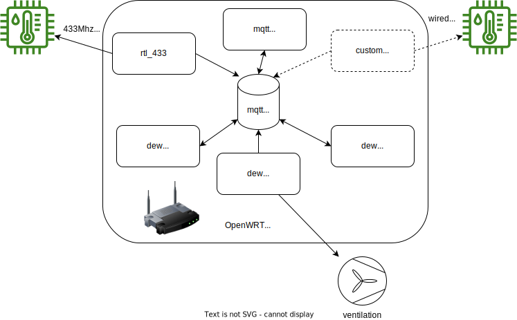

#  OpenDew 



## what is it

a collection of simple shellscripts to 
* collect data from external wireless temperature/humidity sensors
* calculate dewpoint temperature
* turn on/off a fan (through a smartplug)

## why

when last did you ventilate the cellar?

## why openwrt / rtl_433 / shellscript ?

the choise of the components was defined by availability in my stuff box. :)

## todo

add support for wired sensors (i2c/onewire)?

## hardware

- an OpenWRT compatible router (e.g. some from TP-Link) with USB port
- a Realtek RTL2832 based DVB dongle (https://osmocom.org/projects/rtl-sdr/wiki)
- some temperature/humidity sensors (433/868Mhz)

## software

- (os) http://openwrt.org
- (sdr) https://github.com/merbanan/rtl_433 / 
- (broker) https://mosquitto.org


### mqttreader

reads rtl_433 sensor data from 'rtl_433/{hostname}/events' (rtl_433 default topic)

```json
{
  "time": "2024-04-07 16:27:27.095538",
  "model": "Nexus-TH",
  "id": 231,
  "channel": 1,
  "battery_ok": 1,
  "temperature_C": 27.4,
  "humidity": 35
}
```

```json
{
  "time": "2024-04-07 16:27:27.095538",
  "model": "Bresser-3CH",
  "id": 116,
  "channel": 3,
  "battery_ok": 1,
  "temperature_C": 15.5,
  "humidity": 63,
  "mic": "CHECKSUM"
}
```

and publishes to 'app/dewpoint/sensors/in'

```json
{ "name": "id1-231", "temperature_C": 27.4, "humidity": 35 }
```

```json
{ "name": "id3-116", "temperature_C": 15.5, "humidity": 63 }
```

### sensormaster

reads sensor data from 'app/dewpoint/sensor/in'

```json
{ "name": "id1-231", "temperature_C": 27.4, "humidity": 35 }
```

```json
{ "name": "id3-116", "temperature_C": 15.5, "humidity": 63 }
```

uses a configuration to map from external sensor ids to internal names

```json
[
    {
        "name":"id3-116",
        "id":"keller1"
    },  
    {
        "name":"id1-231",
        "id":"aussen1stock"
    }
]
```

calculate dewpoint according to temperature / humidity and publishes to 'app/dewpoint/in'

```json
{
    "ts":"2024-04-07_16:27:29+CEST", 
    "name":"aussen1stock",  
    "temperature_C":27.4, 
    "humidity":35,
    "dew":10.5808
}
```
```json
{
    "ts":"2024-04-07_16:27:30+CEST",
    "name":"keller1",
    "temperature_C":15.5,
    "humidity":63,
    "dew":8.48191
}
```

### dewcalculator

read from 'app/dewpoint/in'


```json
{
    "ts":"2024-04-07_16:27:29+CEST", 
    "name":"aussen1stock",  
    "temperature_C":27.4, 
    "humidity":35,
    "dew":10.5808
}
```
```json
{
    "ts":"2024-04-07_16:27:30+CEST",
    "name":"keller1",
    "temperature_C":15.5,
    "humidity":63,
    "dew":8.48191
}
```

has a mapping where multiple indoor/outdoor sensors can be configured.

```json
{
    "insensors": [
        "keller1"
    ],
    "outsensors": [
        "aussen1stock"
    ]
}
```

when data from every sensor is available   
average outdoor/indoor temperature, humidity and dewpoint are calculated.

publishes to 'app/dewpoint/out'

```json
{
  "ts": "2024-04-07_16:27:32+CEST",
  "dew_avg": {
    "delta": -2.09889,
    "indoor": 8.48191,
    "outdoor": 10.5808
  },
  "temperature_avg": {
    "indoor": 15.5,
    "outdoor": 27.4
  },
  "humidity_avg": {
    "indoor": 63,
    "outdoor": 35
  },
  "sensors": {
    "indoor": [
      {
        "ts": "2024-04-07_16:26:10+CEST",
        "name": "keller1",
        "temperature_C": 15.5,
        "humidity": 63,
        "dew": 8.48191
      }
    ],
    "outdoor": [
      {
        "ts": "2024-04-07_16:27:29+CEST",
        "name": "aussen1stock",
        "temperature_C": 27.4,
        "humidity": 35,
        "dew": 10.5808
      }
    ]
  },
  "app": {
    "dew_diff_min": 1.0,
    "dew_diff_max": 2.3,
    "room_temperature_min": 10.0
  }
}

```

### dewapp

reads from 'app/dewpoint/out'

```json
{
  "ts": "2024-04-07_16:27:32+CEST",
  "dew_avg": {
    "delta": -2.09889,
    "indoor": 8.48191,
    "outdoor": 10.5808
  },
  "temperature_avg": {
    "indoor": 15.5,
    "outdoor": 27.4
  },
  "humidity_avg": {
    "indoor": 63,
    "outdoor": 35
  },
  "sensors": {
    "indoor": [
      {
        "ts": "2024-04-07_16:26:10+CEST",
        "name": "keller1",
        "temperature_C": 15.5,
        "humidity": 63,
        "dew": 8.48191
      }
    ],
    "outdoor": [
      {
        "ts": "2024-04-07_16:27:29+CEST",
        "name": "aussen1stock",
        "temperature_C": 27.4,
        "humidity": 35,
        "dew": 10.5808
      }
    ]
  },
  "app": {
    "dew_diff_min": 1.0,
    "dew_diff_max": 2.3,
    "room_temperature_min": 10.0
  }
}
```

calculates if fan should be turned on/off according temperature / dewpoint data.

publishes to 'app/dewpoint/control'

```json
{
    "ts":"2024-04-07_16:27:37+CEST",
    "type":"control",
    "fan":0
}
```

### dewcontrol

reads from 'app/dewpoint/control'

```json
{
    "ts":"2024-04-07_16:27:37+CEST",
    "type":"control",
    "fan":0
}
```

read user provided functions from '/etc/opendew/custom.sh'

```sh

# custom user actions can be executed here

custom_fanon() {
	logger "custom fan on :)"
    curl http://espplug.fritz.box/cm?cmnd=Power%20on
}

custom_fanoff() {
	logger "custom fan off :)"
    curl http://espplug.fritz.box/cm?cmnd=Power%20off
}

custom_status_on() {
    logger "custom status changed to on"
}

custom_status_off() {
    logger "custom status changed to off"
}
```

executes custom_fanoff() or custom_fanon()  functions (if defined).

### configuration

configfile '/etc/opendew/opendew.cfg'

```

MQTTHOST="localhost"
MQTTPORT="1883"
MQTTUSER=""
MQTTPASS=""

MQTTTOPICBASE="app/dewpoint"

MQTTREADER_INTOPIC="rtl_433/+/events"

DEW_DIFF_MAX=2.3
DEW_DIFF_MIN=1.0 
ROOM_TEMP_MIN=10.0

SENSORMASTERCONFIG='[{"name":"id3-116","id":"keller1"},{"name":"id1-231","id":"aussen1stock"}]'

SENSORCONFIG='{"insensors":["keller1"],"outsensors":["aussen1stock"]}'

```
